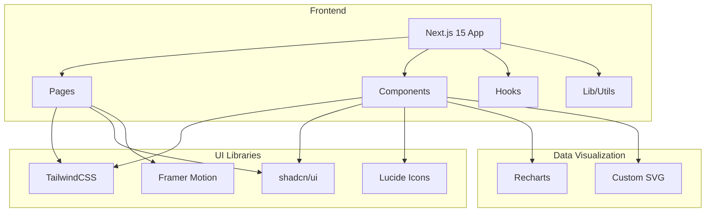

# HKAIC Technical Architecture

## 1. Architecture Overview



## 2. Technology Stack

### Core Framework
- **Framework**: Next.js 15 (App Router)
- **Language**: TypeScript
- **Styling**: TailwindCSS 3.4+
- **Components**: shadcn/ui (Radix primitives)
- **Animations**: Framer Motion

### UI Enhancement
- **Icons**: Lucide React
- **Charts**: Recharts
- **Canvas Effects**: Native Canvas API / particles.js

### Development
- **Package Manager**: npm
- **Linting**: ESLint
- **Formatting**: Prettier

## 3. Project Structure

```
hkaic/
├── app/
│   ├── layout.tsx          # Root layout with providers
│   ├── page.tsx             # Landing page
│   ├── globals.css          # Global styles + Tailwind
│   ├── dashboard/
│   │   └── page.tsx         # Dashboard page
│   ├── upload/
│   │   └── page.tsx         # Upload page
│   └── report/
│       └── page.tsx         # Report detail page
├── components/
│   ├── ui/                  # shadcn/ui components
│   │   ├── button.tsx
│   │   ├── card.tsx
│   │   ├── input.tsx
│   │   ├── badge.tsx
│   │   └── ...
│   ├── landing/
│   │   ├── hero.tsx
│   │   ├── features.tsx
│   │   ├── ai-analysis.tsx
│   │   ├── copilot.tsx
│   │   └── cta.tsx
│   ├── dashboard/
│   │   ├── stats.tsx
│   │   ├── recent-logs.tsx
│   │   └── quick-actions.tsx
│   ├── upload/
│   │   ├── upload-zone.tsx
│   │   └── format-select.tsx
│   ├── report/
│   │   ├── overview.tsx
│   │   ├── metrics.tsx
│   │   └── suggestions.tsx
│   └── layout/
│       ├── navbar.tsx
│       └── footer.tsx
├── lib/
│   ├── utils.ts             # Utility functions
│   └── cn.ts                # Class name merger
├── hooks/
│   └── use-animation.ts     # Animation hooks
├── public/
│   └── ...                  # Static assets
├── package.json
├── tailwind.config.ts
├── tsconfig.json
└── next.config.js
```

## 4. Route Definitions

| Route | Purpose | Auth Required |
|-------|---------|---------------|
| `/` | Landing page | No |
| `/dashboard` | User dashboard | Yes |
| `/upload` | Upload flight log | Yes |
| `/report/[id]` | Analysis report detail | Yes |

## 5. Component Inventory

### Landing Components

| Component | Description | States |
|-----------|-------------|--------|
| `Hero` | Animated hero with particles | Default |
| `Features` | 6 feature cards grid | Default, Hover |
| `AIAnalysis` | Interactive analysis demo | Default, Loading |
| `Copilot` | Chat interface mockup | Default, Typing |
| `CTA` | Email capture section | Default, Submitting, Success |

### Dashboard Components

| Component | Description | States |
|-----------|-------------|--------|
| `Stats` | Metric cards with trends | Loading, Loaded |
| `RecentLogs` | Recent upload list | Empty, Loaded |
| `QuickActions` | Quick action buttons | Default |

### Upload Components

| Component | Description | States |
|-----------|-------------|--------|
| `UploadZone` | Drag-drop area | Default, Dragover, Uploading, Success, Error |
| `FormatSelect` | Format dropdown | Default, Open |
| `Progress` | Upload progress bar | Uploading, Complete |

### Report Components

| Component | Description | States |
|-----------|-------------|--------|
| `Overview` | Score cards & gauges | Loading, Loaded |
| `Metrics` | Detailed metrics grid | Default |
| `Suggestions` | AI recommendations | Loading, Loaded |

### Shared Components

| Component | Description |
|-----------|-------------|
| `Navbar` | Top navigation with blur |
| `Footer` | Site footer |
| `Button` | Primary/Secondary/Ghost variants |
| `Card` | Glass-morphism card container |
| `Badge` | Status/Category badges |
| `Input` | Form input with focus glow |

## 6. Data Models

### Mock Data Structures

```typescript
interface FlightLog {
  id: string;
  filename: string;
  format: 'DJI' | 'PX4' | 'Betaflight';
  uploadDate: Date;
  duration: number; // seconds
  status: 'processing' | 'ready' | 'error';
}

interface AnalysisReport {
  id: string;
  logId: string;
  flightScore: number; // 0-100
  efficiencyScore: number;
  stabilityScore: number;
  riskLevel: 'low' | 'medium' | 'high';
  riskScore: number;
  pidAnalysis: {
    pitch: { p: number; i: number; d: number };
    roll: { p: number; i: number; d: number };
    yaw: { p: number; i: number; d: number };
  };
  batteryHealth: {
    voltageDrop: string;
    remainingCapacity: string;
    cyclesEstimate: number;
  };
  riskFactors: string[];
  recommendations: string[];
  generatedAt: Date;
}

interface DashboardStats {
  totalFlights: number;
  totalAnalyses: number;
  averageScore: number;
  trend: 'up' | 'down' | 'stable';
}
```

## 7. Animation Specifications

### Hero Section
- **Particle Canvas**: 50+ floating particles with parallax
- **Text Animation**: Fade-in with 50ms stagger per word
- **CTA Buttons**: Scale 1.02 + glow on hover, 200ms ease

### Feature Cards
- **Hover**: translateY(-8px) + border glow, 300ms
- **Icon**: Subtle bounce animation loop

### Charts
- **Draw Animation**: SVG path drawing 1s ease-out
- **Data Points**: Pop-in with scale 0→1, 300ms spring

### Upload Zone
- **Dragover**: Border color cyan + scale 1.01
- **Progress**: Linear fill animation
- **Success**: Checkmark pop + confetti burst

### Page Transitions
- **Fade**: Opacity 0→1, 400ms
- **Slide**: translateY(20px)→0, 400ms ease-out

## 8. Responsive Breakpoints

| Breakpoint | Min Width | Layout Changes |
|------------|-----------|----------------|
| Mobile | 0px | Single column, hamburger menu |
| Tablet | 768px | 2-column grids, side padding |
| Desktop | 1024px | Full layout, 3-column grids |
| Wide | 1280px | Max-width container 1280px |

## 9. Performance Optimizations

- **Image Optimization**: Next.js Image component
- **Code Splitting**: Dynamic imports for heavy components
- **Font Optimization**: next/font for Inter/JetBrains Mono
- **Lazy Loading**: Intersection Observer for below-fold content
- **Bundle Size**: Target < 150KB initial JS
