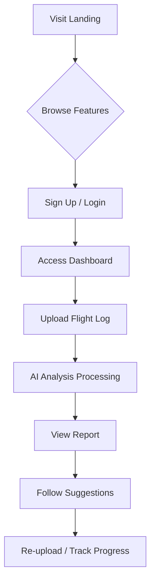
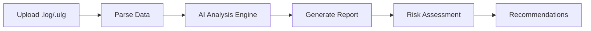

# HKAIC - AI Drone Flight Intelligence Platform

## 1. Product Overview

HKAIC is a modern AI-powered SaaS platform for drone flight intelligence, providing flight log analysis, AI-optimized parameter tuning, and intelligent drone copilot services.

**Target Users**: Drone pilots, drone enthusiasts, drone service companies, and UAV operation teams.

**Market Value**: Aims to become the leading AI platform for drone data intelligence, helping users optimize flight performance and ensure flight safety through advanced AI analysis.

---

## 2. Core Features

### 2.1 User Roles

| Role | Registration Method | Core Permissions |
|------|---------------------|------------------|
| Guest User | Optional | Browse landing page, view features |
| Registered User | Email / GitHub OAuth | Upload logs, view analysis reports, use copilot |

### 2.2 Feature Module

1. **Landing Page**: Hero section, features showcase, AI flight analysis demo, drone copilot intro, CTA section
2. **Dashboard**: User dashboard with flight history, quick analysis, recent reports
3. **Upload Flight Log**: Drag-and-drop log upload, format selection, upload progress
4. **AI Analysis Report**: Detailed flight analysis, risk assessment, optimization suggestions

### 2.3 Page Details

| Page | Module | Features |
|------|--------|----------|
| Landing | Hero | Animated headline, particle background, floating drone visualization |
| Landing | Features | 6-card grid showcasing core capabilities |
| Landing | AI Analysis | Interactive demo with mock data visualization |
| Landing | Copilot | Chat interface mockup with AI responses |
| Landing | CTA | Email capture form with gradient button |
| Dashboard | Stats | Flight count, analysis count, trend charts |
| Dashboard | Recent Logs | List of recent uploads with quick actions |
| Upload | Upload Zone | Drag-drop area, file type indicators, progress bar |
| Upload | Format Select | Dropdown for log format (DJI, PX4, Betaflight) |
| Report | Overview | Score cards, key metrics visualization |
| Report | Details | PID analysis, battery health, risk factors |
| Report | Suggestions | AI-generated optimization recommendations |

---

## 3. Core Process

### User Flow

### Analysis Flow

---

## 4. User Interface Design

### 4.1 Design Style

**Aesthetic Direction**: Apple + Tesla + Cyberpunk Fusion
- Ultra-dark backgrounds with electric blue glows
- Clean, minimal Apple-like typography and spacing
- Tesla-inspired dashboard layouts with data visualization
- Cyberpunk neon accents and futuristic UI elements

**Color Palette**:
- Background Primary: `#000000` (Pure Black)
- Background Secondary: `#0A0A0F` (Deep Space)
- Surface: `#111118` (Card Background)
- Border: `#1E1E2E` (Subtle Borders)
- Accent Primary: `#00D4FF` (Electric Cyan)
- Accent Secondary: `#7C3AED` (Neon Purple)
- Success: `#10B981` (Matrix Green)
- Warning: `#F59E0B` (Amber)
- Danger: `#EF4444` (Red Alert)
- Text Primary: `#FFFFFF`
- Text Secondary: `#94A3B8`
- Text Muted: `#64748B`

**Typography**:
- Display: SF Pro Display / Inter (fallback: system-ui)
- Body: SF Pro Text / Inter
- Mono: JetBrains Mono (for data/code)

**Button Style**:
- Rounded corners (8-12px radius)
- Glow effects on hover
- Gradient fills for primary actions
- Subtle shadow + border

**Layout**:
- Full-width sections with max-width containers
- Card-based content organization
- Generous whitespace
- Top navigation with blur backdrop

**Icon Style**:
- Lucide React icons
- Consistent 24px size
- Cyan accent color

### 4.2 Page Design Overview

| Page | Module | UI Elements |
|------|--------|-------------|
| Landing | Hero | Animated gradient text, particle canvas, floating 3D elements, CTA buttons with glow |
| Landing | Features | Glass-morphism cards, hover lift effects, icon animations |
| Landing | AI Analysis | Dark chart containers, glowing data points, interactive sliders |
| Landing | Copilot | Chat bubble UI, typing indicator, suggestion chips |
| Landing | CTA | Full-width gradient section, email input with validation |
| Dashboard | Stats | Metric cards with sparklines, animated counters |
| Dashboard | Recent | Table/list with status badges, quick action buttons |
| Upload | Zone | Dashed border, icon animation, progress ring |
| Report | Overview | Score gauges, mini charts, risk meters |
| Report | Details | Accordion sections, code blocks for PID values |

### 4.3 Responsiveness

- **Desktop-first** design (1280px+)
- **Tablet** adaptation (768px-1279px)
- **Mobile** responsive (< 768px)
- Touch-friendly tap targets (min 44px)
- Collapsible navigation on mobile

### 4.4 Visual Effects

- **Particle Background**: Floating dots with parallax effect
- **Gradient Orbs**: Blurred color spheres for depth
- **Glow Effects**: Box-shadow with accent colors
- **Glass Morphism**: backdrop-blur with transparency
- **Smooth Transitions**: 300ms ease-out default
- **Hover States**: Scale + glow + border color change

---

## 5. Technical Implementation Notes

### Animation Libraries
- Framer Motion for React animations
- Canvas for particle effects
- CSS animations for simple transitions

### Chart Libraries
- Recharts for data visualization
- Custom SVG gauges for scores

### Performance Targets
- First Contentful Paint: < 1.5s
- Largest Contentful Paint: < 2.5s
- Cumulative Layout Shift: < 0.1
